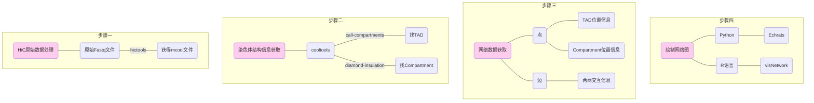

# hicGraph

​        **hicGraph**是用于网络可视化的脚本。可以利用python或R语言，将热图中的信息以网络图的形式展现。




# Installation

- 下载hicGraph.zip并解压

```shell
git clone http://www.github.com/LittleHan/HicGraph
gunzip hicGraph.zip
```


# Usage

- Python

```shell
python main.py [-h] -o OUTPUT --compartment COMPARTMENT --tad TAD --mcool MCOOL -c CHR --start START --end END [--genre GENRE] [-q QUANTILE] [--raw]
```

- R

```shell
Rscript hicGraph.R WORK_DIR MCOOL TAD COMPARTMENT OUTPUT_DIR CHR [COM_NAME] [TAD_NAME]
```

### Input

- a MCOOL file ：包含了染色体内的交互信息
- a BED file1 ：包含了每条染色体上TAD的位置信息
- a BED file2 ：包含了每条染色体上COMPARTMENT的位置信息

### Output

- an HTML file

### Options

- common

|     option      | description                                      |
| :-------------: | :----------------------------------------------- |
|    `--mcool`    | mcool文件所在目录及文件名                        |
|     `--tad`     | 含有TAD位置信息的BED文件所在目录及文件名         |
| `--compartment` | 含有compartment位置信息的BED文件所在目录及文件名 |
|     `--chr`     | 字符串，定义需要绘制的染色体                     |
| `-o`/`--output` | 定义结果文件名称                                 |

- Python

|      option      | description                                                  |
| :--------------: | :----------------------------------------------------------- |
|    `--start`     | 数值，定义绘制的起始位点                                     |
|     `--end`      | 数值，定义绘制的终止位点                                     |
|  `-g`/`--genre`  | 输出图片的类型，可选以TAD、Compartment或Fragment为节点的网络图 |
| `-q`/`-quantile` | 定义边的筛选分位数                                           |
|     `--raw`      | 若结构信息文件是从cooltools直接获得的原始数据，需要添加该参数 |
|  `-h`/`--help`   | 显示帮助文档                                                 |

- R

| parameter  | description                   |
| :--------: | :---------------------------- |
| `WORK_DIR` | 设置脚本运行的工作目录        |
| `COM_NAME` | 字符串，所选Compartment的名称 |
| `TAD_NAME` | 字符串，所选TAD的名称         |


## Examples

### Python

```shell
python hicGraph.py --mcool test.mcool --tad Tad.bed --compartment Compartment.bed -o test -chr chr22 -g compartment
```


### R语言

- 画所选染色体（chr22）所有Compartment的交互网络图

```shell
Rscript hicGraph.R ./ ./data/Rao_chr22.mcool ./data/Rao_tad.bed ./data/Rao_compartment.bed ./ chr22
```


- 选择序号为38的Compartment，绘制该Compartment内所有Tad的交互网络图

```shell
Rscript hicGraph.R ./ ./data/Rao_chr22.mcool ./data/Rao_tad.bed ./data/Rao_compartment.bed ./ chr22 com_38
```


- 选择序号为91的Tad，绘制该Tad内所有Fragment的交互网络图

``` shell
Rscript hicGraph.R ./ ./data/Rao_chr22.mcool ./data/Rao_tad.bed ./data/Rao_compartment.bed ./ chr22 com_38 tad_91
```


